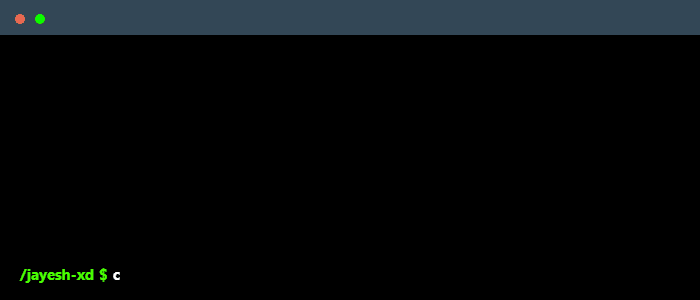

# 💫 About Me:

  

- ⚡ Fun fact **I enjoy converting engineering ideas into practical hardware-software projects.** 
## 🌐 Socials:

 
  
# 💻 Tech Stack:
               
# 📊 GitHub Stats:
 
##  

## 🏆 GitHub Trophies

### ✍️ Random Dev Quote

---

  

  ## 💰 You can help me by Donating
   

  
<!-- Proudly created with GPRM ( https://gprm.itsvg.in ) -->
